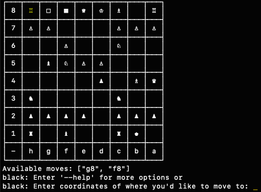

# chess_ruby
The Odin Project Ruby Final Project : create a full working version of chess on the command line.

To play, clone repository and run $ ruby lib/play.rb

Written in Ruby 2.7, gems required: 'pastel', 'tty-table', 'json'. 

No stalemates, no en passant, just an old fashioned game of two-player chess with simple terminal aesthetic.
